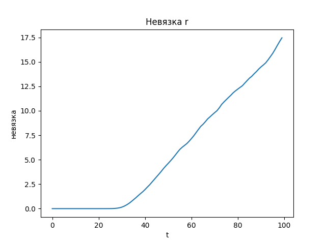

## Dynamic memory time

The C code mdlj_divergence.c has been modernized to calculate simultaneously two trajectories with different parameters dt (in this folder, the gap ratio = 5, in the folders dt2/ and dt10/ 2 and 10, respectively). The python script plots velocity and distance residuals based on data from *.txt files. More details about the results in the report.

 

