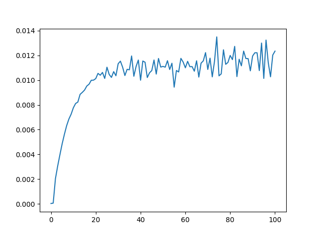

## Averaging error estimate

The script plots the block average method to obtain the averaging error. The data for the method is taken from the _slurm-out.txt files. Also, the mean and variance values are saved in json format in the data.txt file. More details in the report.

 

