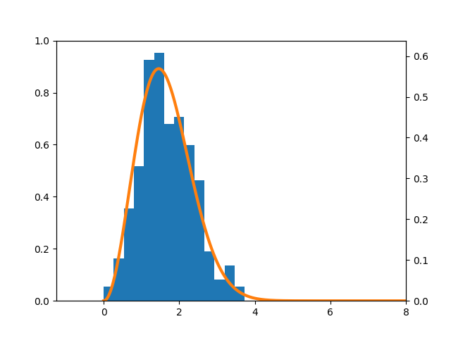

## Checks at what point the Maxwell distribution is set in the system

The script for constructing histograms predicts the distribution parameters based on the results of MD simulation from the src/ catalog and builds histograms in the hists/ folder, which can be used to determine at what point the distribution becomes close to the Maxwell distribution. More details in the report (see file task1/otchet.pdf)

​
