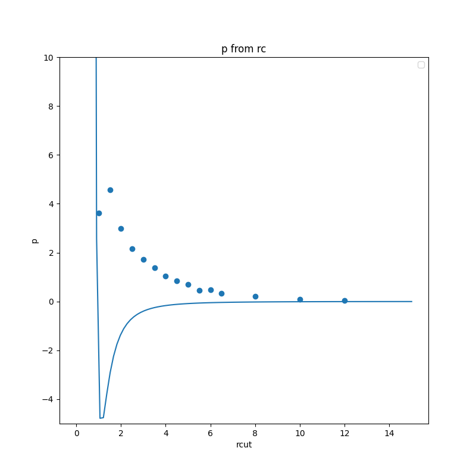

## Equation of state

The C code mdlj_nve.c has been modernized to calculate the MD trajectory with a scaling thermostat. Scripts and data for the execution of point a) and point b) of this task are located in the first/ and second folders/, respectively. More details about the results and performance in the report and in the task description.

 

